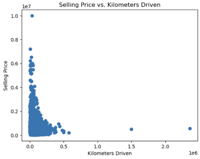
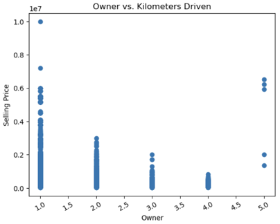
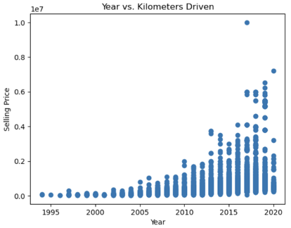
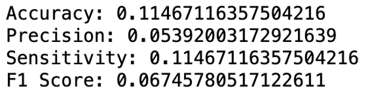
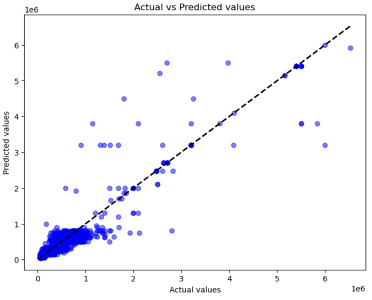
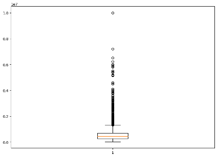

# Predicting Vehicle Pricing

Collaborative machine learning project applying linear regression to predict second-hand vehicle selling prices using a dataset of ~8,100 listings.

## Business Question

What factors most strong predict the optimal selling price of a second-hand vehicle?

## Dataset

8,128 vehicle listings sourced from Kaggle with 13 features including name, year, selling_price, km_driven, fuel, seller_type, transmission, owner, mileage, engine, max_power, torque, and seats.

## Exploratory Data Analysis

Selling price shows an inverse relationship with kilometers driven as higher mileage vehicles sell for significantly less

Vehicles with multiple previous owners also command lower prices, with first-owner cars selling at a premium.

Newer vehicles (post-2015) sell for substantially more, with 2020 models commanding the highest prices in the dataset.

## Model Results

The model explains 68% of variance in selling prices. Predictions are most accurate for lower-priced vehicles, with larger errors at higher price points.

## Methodology
- Preprocessed data by removing rows with missing values and encoding categorical variables numerically
- Removed irrelevant features (name, torque) and set selling_price as target variables
- Split data 70/15/15 into training, validation, and test sets
- Applied linear regression to establish relationships between vehicle attributes and selling price

## Results
- R² Score: 68% (validation), 66% (test)
- Year and Kilometers driven identified as strongest price determinants
- Newer cars and lower mileage vehicles consistently commanded higher prices

## Limitations
- Deleting missing rows may have introducted sampling bias
- Linear regression assumes linear relationships hich may not capture full market dynamics
- Outliers were not removed wihich likely impacted model accuracy
- Regional market factors and vehicle condition were not available in the dataset

## How to Run 
1. Download `SS_Code.ipynb` and `Car_Details.csv` file
2. Open in Jupyter Notebook or Google Colab
3. Run cells sequentially from top to bottom
